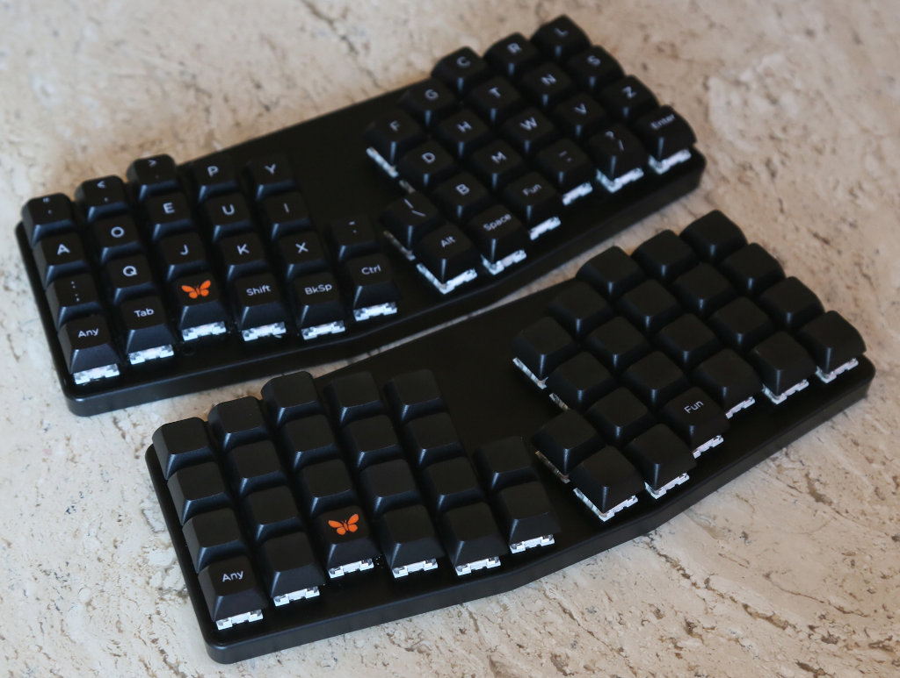
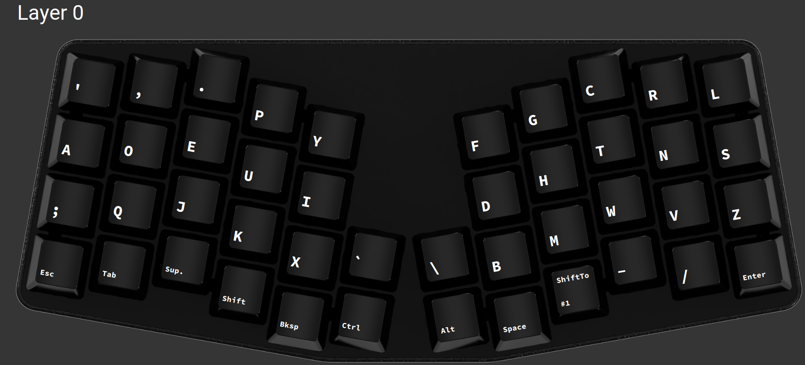
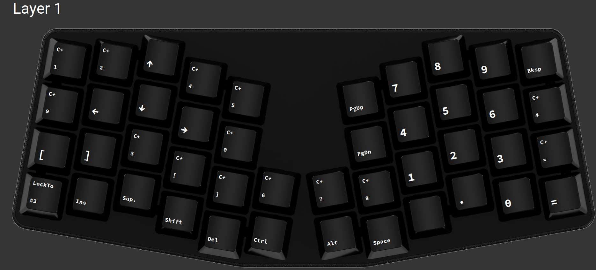
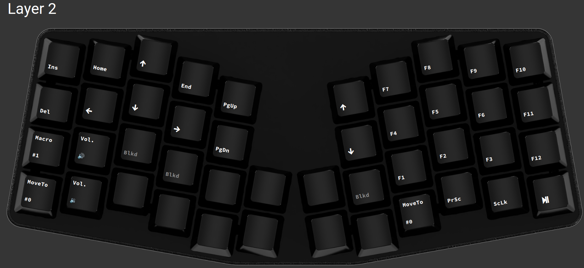

## Introduction

This repository has my Atreus layout configuration. I
personally *highly* recommend these boards (I own two of
them and use them daily (along with a Kinesis Advantage 2,
several X-bows models, and a number of other mechanical
boards).), and I am not in any way affiliated with
Keyboardio.

This will be of extremely-limited interest since:

1) It's a layout for a fairly-niche mechanical keyboard.

1) It's Dvorak.

- [Get an Atreus here.](https://shop.keyboard.io/products/keyboardio-atreus)
  (Not sponsored / affiliated.)

  - I have Atreus boards each with Speed Silver (liner /
    quiet) and Speed Bronze (clicky) switches; they're both
    great, and I switch depending on my mood.

  - Here's some weak evidence that I have a couple of Atreus
    boards (or at least a photo of a couple of them):

    

## The Layout

- Here's where you can get the [layout file as
  JSON](./AtreusLayout.json), suitable for importing to
  Chrysalis, which is what I've used to flash layouts to the
  board:

  - [Chrysalis on GitHub](https://github.com/keyboardio/Chrysalis)

  - I just installed it via `yay -S chrysalis` ... If you
    don't Arch, not sure if there's a better option than
    grabbing source from GitHub (... and maybe consider
    Arching!?).

- Here's the layout in some images that I grabbed from
  Chrysalis:

  - 

  - 

  - 

## Protips

Nobody asked but ... If you're buying an Atreus:

- consider the blank keycaps; they're fantastic.

- buy the carrying case: If you're a big enough nerd that
  you're using a layered ergo mech board, you *know* that
  you want a carrying case for it -- it has a belt loop,
  FFS!

- use the `Any` keycap ... why wouldn't you want a keyboard
  with a *literal* `Any` key!?
